# T2A2 API Webserver - Family Scheduler API

### R1. The problem this app will solve:
Forgot that water bill ? or cant remember the date of that family bbq ? were you invited to your cousins birthday party ?

In Australia if you are late on paying a bill, in particular a credit card or loan, this will affect your financial credit score, even if you forget. Missing just one repayment could drop your credit score by 22%. An American collections company did a survey in 2022 of more than 1100 people and found that 72% were in collections because of non-financial factors, with 32% of this group being because they forgot to pay their bills.

References:

Turner H. 2024. Understanding the Impact of Late Payments on Your Credit Score. [Online]
Available at: https://www.jacarandafinance.com.au/general/impact-of-late-payments-on-your-credit-score/

Lexop. 2022. Consumers are forgetting to pay their bills - here’s how to fix that! [Online]
Available at: https://www.lexop.com/blog/consumers-forgetting-to-pay-bills

This problem of forgetting when bills are due to be paid or those family outings you dont want to miss out on, is what this family scheduler app will help solve. It is a scheduler app designed for family members and their family group with two main functions.

**_Please note the terms used for this documentation:_**

**_- member(s) = a family member or members.Eg: Parents & their children._**

**_- Intra group = the immediate family members group._**

**_- Inter group = another external Intra group that has a family relationship._**

### App Main Functions to resolve the problem:
The first function is family members are able to save intra group bill details and when / if they have been paid. All intra group members can add, view and edit bills. Only administrator members can delete bills.

The second function is family members are able to create intra group outings & outings to invite inter groups. These outings can be anything where a family member of their intra group are going / doing something like appointments, meetings, get togethers & holidays. These outings can be marked as private, which means only intra group member(s) will be attending OR outings can be marked as public, which means these outings are for the intra group wanting to invite and participate with other inter groups in the app.

A intra group member can choose which other inter groups to invite to a public outing they have created. Intra groups can view all the public outing invites they have and choose to respond to each particular invite.

### R2. Task management of the SDLC:
For the task management of this application i am using Trello to monitor and apply each task in the development stages of Backlog, In Progress, In Testing, Done & Issues / Rework. For starting the app project all tickets were created and applied to Backlog, then the first ticket of creating a ERd diagram and explanation of features was done & submitted for approval. 
For version control and tracking of changes in the code while developing the app, I am using GitHub and have created a repository which can be located here: [T2A2 Family Scheduler API GitHub repository](https://github.com/smallDazza/T2A2-Webserver/tree/main)
 - #### Stage 1:
    Tasks to explain functions, ERD and start setting up GitHub repo:

 - #### Stage 2:
    For the app IDE I am using VSCode, for the database using PostgreSQL. In progress tickets for setting up these 2 environments + setup a virtual environment and installing the python libraries / modules required:

 - #### Stage 3:
    Start with coding the main files located in the src folder and the 5 Models located in the models folder:

 - #### Stage 4:
    Continue to create a CLI controller and test the database relations and attributes can correctly be created, dropped and seeded with the sample information:

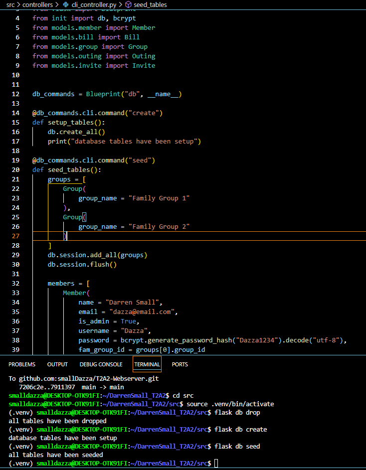
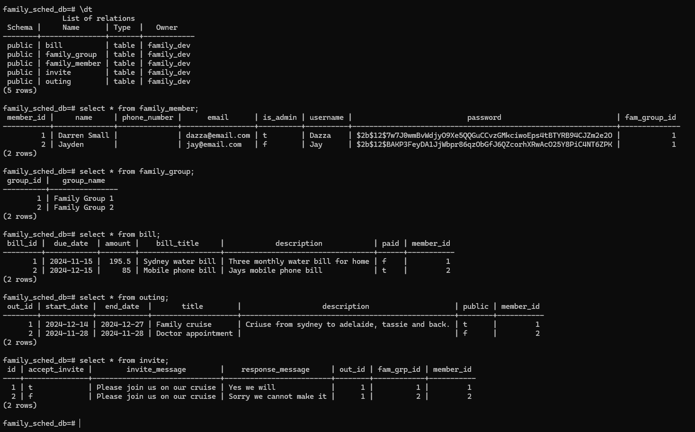

 - #### Stage 5:
    Start to develop the 5 contollers which are to be saved in the controllers folder:

 - #### Stage 6:
    The API testing software being used is Insomnia. In this stage setup a T2A2 folder in Insomnia and add all the http requests required for testing the 5 controller endpoints. Then start with testing just the Group & Members controllers:

 - #### Stage 7:
    API testing of the Bill, Outing & Invite contolllers using Insomnia:

 - #### Stage 8:
    Go back through the 5 controllers and test add the error handling options required:

 - #### Stage 9:
    Final manual testing of all controllers, models and functionality to meet project scope:

 - #### Stage 10:
    Start the documentation process:

### R3. Third Party Services
For the development of this application the following third party services, packages or dependencies have been installed and can be referenced in the src\requirements.txt file:

Details:
 - Bcrypt ver 4.2.0 & Flask-Bcrypt ver 1.0.1 (this a flask extension for bcrypt) = this is a cryptographic hash function designed for password hashing and safe storing in the backend of applications. In the coding of this app we are using 2 functions:

    1 - to hash the password in the database relation when entered & saved by the user, this function is used: `bcrypt.generate_password_hash(password).decode("utf-8")`

    2 - to check the hashed password when members are logging into the app, this function is used: `bcrypt.check_password_hash(member.password, body_data.get("password")):`

 - Flask ver 3.0.3 = Flask is a micro web framework for python code designed to build web applications. In this applications case it provides the API functionality to use routing, request handling, configuration etc. Flask also depends & installs the Werkzeug WSGI toolkit, the Jinja2 template engine, and the Click CLI toolkit.

 - Flask-JWT-Extended ver 4.6.0 = Flask-JWT-Extended helps you easily implement JSON Web Token (JWT) authentication in your Flask applications. JWTs are a popular way to handle authentication because they are secure, stateless, and flexible. In the coding of this app we are using 3 functions: `jwt_required, create_access_token, get_jwt_identity`.

 - marshmallow ver 3.22.0 & flask-marshmallow ver 1.2.1 = this is used for object serialization and deserialization and converting this data into python objects. It is used in this app to convert the data types entered of a JSON format and convert it into python objects. The functions are used in all the 5 Model Schemas for example: `class MemberSchema(ma.Schema):`

 - SQLAlchemy ver 2.0.34 & Flask-SQLAlchemy ver 3.1.1 = this simplifies the connection between the python code and the SQL databases by automatically converting python class calls into SQL statements. In the initialisation of this app it is applied to a variable called : `db = SQLAlchemy()`. Then used in all the Models to create the database relations & attributes using the db variable. Eg: `member_id = db.Column(db.Integer, primary_key=True)`.

 - python-dotenv ver 1.0.1 = this is used to read the key-value variables from the ` .env` file and sets them as app environment variables. This allows the connection details to the database to be used and stored in the .env file and because this file is added to the .gitignore file, it hides the connection details from public access.

 Other python modules imported and used in this app are :
 - datetime = this allows the use of a date format to be used in certain variables. Example : ` user_date = datetime.strptime(user_date_ent, "%Y-%m")`.

### R4. Apps Database System
For this app we have used the PostgreSQL open source object-relational database system. This is one of the oldest and most advanced database management systems available and because it is open source & has a large community that actively support it, this makes it very stable for all types of applications.

Benefits of using PostgreSql:
- first of all being open source this makes it free with no need for any licence charges. This allows the users freedom over all areas of their database design, security and adaptability.   
- It is a RDBMS system compliant with SQL standard making it easy to use for developers and users familiar with SQL.
- Postgres became ACID compliant in 2001, meaning it has the 4 properties of atomicity, consistency, isolation & durability, making it well known for its reliability. It can handle a large amount of data while being highly stable and not crashing or losing data. This maintains data integrity and does offer write ahead logging, to prevent data loss, as well as crash recovery procedures.
- Postgres is highly extensible & flexable. What this means is the database can easily be extended, it is not fixed, and supports a wide range of inbuilt data types as well as any new custom data types, functions, operators and languages can easily be added as required.
- It is highly scalable. Postgres can be run on a single server or multiple servers to manage large amounts of data. It can also handle a large number of concurrent users making it the ideal choice for large applications requiring both these features.
- Has MVCC - Multi Version Concurrency Control which enables the use of multiple transactions accessing the same data simultaneously with out any issues.
- Postgres security is very high with role based access controls, secure connections and data encryption available.
- Postgres can support data warehousing and business intelligence tasks with advanced analytics & data visualization.

Drawbacks of using PostgreSQL:
- Postgres performance can be slower than other database systems when performing certain types of data structures or queries.
- For new users and developers it can be quite complicated and hard to learn. Because the database is highly configurable, this type of complexity is a potentail drawback.
- The Postgres documentation can be hard to navigate, as being open source there are a large volume of resources.
- Not in the case if this app, but if required migrating data from other databases is challenging and difficult, especially for large amounts of data.

References:

Vojak, J. 2022. Exploring the pros and cons of SQL databases — MySQL, Postgres, Oracle, Microsoft SQL, and Amazon Aurora. [Online] 
Available at: https://josipvojak.com/exploring-the-pros-and-cons-of-sql-databases-mysql-postgres-oracle-microsoft-sql-and-amazon-3c8de880b8d4

Nguyen, H. 2024 What is PostgreSQL and Everything You Need to Know. [Online] 
Available at: https://techvify-software.com/what-is-postgresql/

BrainerHub Solutions. 2023. PostgreSQL: A Practical Guide—Features and Advantages. [Online] 
Avaliable at: https://www.linkedin.com/pulse/postgresql-practical-guidefeatures-advantages-brainerhub-solutions

### R5. ORM used in this app
The object relational mapping (ORM) system used in the application is SQLAlchemy. SQLAlchemy is a python SQL toolkit library imported into this app with the purpose of converting objects in the python code language into SQL queries to work with the PostgreSQL database. The features and functionalities of SQLAlchemy are:
- The first component is called the Core, which is a sql abstraction toolkit that provides a layer of DBAPI implementations and behaviours using sql expression language, which allows sql language expressions via python code expressions. The schema system can emit DDL statements which allows mapping from any python types to sql database types. Here is an example of Python code in the cli_controller.py file, using the SQLAlchemy variable (called 'db') for a DDL statement to create all database tables and their attributes: 

    `def setup_tables():
        db.create_all()`

Then in the Models, member.py file the table and its attributes:
`
    class Member(db.Model):
    __tablename__ = "family_member"
    member_id = db.Column(db.Integer, primary_key=True)
    name = db.Column(db.String(100), nullable=False)
    phone_number = db.Column(db.Integer)
    email = db.Column(db.String(50))
    is_admin = db.Column(db.Boolean, default=False)
    username = db.Column(db.String(20), nullable=False, unique=True)
    password = db.Column(db.String, nullable=False)
`
- The second component is known as the ORM that provides the data mapper pattern which builds upon the Core. This allows multiple ways where python objects & classes can be mapped to the database allowing the object model and database schema to be decoupled in a clean way.
- A central part of the ORM system can organise pending insert / update / delete operations into queues and then flushes them all into one batch. This produces transaction safety with the maximum of efficiency. An example of this in the cli.controller.py file code to seed test data into the newly created database tables:
`
    def seed_tables():
    groups = [
        Group(
            group_name = "Family Group 1"
        ),
        Group(
            group_name = "Family Group 2"
        )
    ]
    db.session.add_all(groups)
    db.session.flush()
`
This seed_tables function has multiple flush() functions after each table had sample data added.
- Another function allows SQL clauses to be built via Python functions and expressions. This includes the following: boolean expressions, operators, functions, table aliases, selectable subqueries, insert/update/delete statements, correlated updates, selects, and EXISTS clauses, UNION clauses, inner and outer joins, bind parameters, and free mixing of literal text within expressions.
- SQLAlchemy can be modular, meaning different elements like sql statement compilation and transactional services can be used independently of each other.
- Primary and foreign keys in SQLAlchemy are represented as sets of columns and the ORM supports common PK patterns such as association objects (many to many relationships.)
- Has been constantly developed, profiled and refactored over 7 years that has led to a high performing & accurate toolkit and deployed in thousands of environments.
- SQLAlchemy includes and supports PostgreSQL databases which is why it is the ORM of choice for this application.

References:

Cdata Blogg. 2024. What is SQLAlchemy Used For? [Online]
Available at: https://www.cdata.com/blog/what-is-sqlalchemy

SQLAlchemy. Key Features of SQLAlchemy [Online]
Available at: https://www.sqlalchemy.org/features.html

### R6. Designed ERD Diagram
Here is a image of the approved ERD diagram designed with a legend added for the Family Scheduler App:

In the design of this ERD diagram and legend I have used CROWS FOOT NOTATION and identified 5 tables (entities) with their included columns (attributes) and then the relationships between these tables.The relationships between the tables via use of the primary keys and foreign keys are as follows:
- from family_group to family_member = mandatory one to many because a member must belong to a group and can have many members.
- from family_member to bill = optional one to many because a member may or may not have many bills.
- from family_member to outing = optional one to many because a member may or may not have many outings.
- from family_group to invite_outing = mandatory one to many because a invite to a outing must belong to a group and can have many invites.
- from family_member to invite_outing = optional one to many because a member may or may not have many invites to outings.
- from outing to invite_outing = mandatory one to many because a invite to a outing must belong to an outing and can have many invites.

All the entities in this ERD diagram design are normalised to the forms below:
- the one group = family_group entity is still in the 2NF form as it only contains one attribute column after the PK.

The other entities are all in the BCNF form (Boyce-Codd Normal Form ) by:
- meeting the 3NF form of not having any transitive functional dependencies. A transitive functional dependency is when a change in a column (which is not a primary key) may cause any of the other columns to change.
- A table is in BCNF if and only if every determinant in the table is a candidate key. A candidate key is a set of attributes (or attribute) that uniquely identify the tuples in relation to a table. 

An example of what an entity could look like in another normalisation level could be the family_member entity. This could be moved back into a 3NF form because by adding a family_group attribute (thus removing the family group entity) BUT this would make the current family_group FK key in the invite_outing table redundant and then would require this to be a family group attribute independant & stand alone. This is not a good idea and may cause issues if a group is missed or NULL from a outing invite.

### R7. Implemented Models
The implemented Models and their relationships since coding has begun have been done as follows.
In the Models folder = 5 implemented models :
1. group.py - this model has a PK and an attribute (Note: during coding decided to add a constraint to this attribute of 'UNIQUE') : 

. 

Then 2 relationships with the member model and the invite model; 
    - The interaction between the member model is via the members variable which back populates to the group variable in member.py. The cascade & passive_deletes works with 'ondelete=CASCADE' in the Member foreign key to delete all members in a group if the group is deleted. Example of the code in both group & member models : 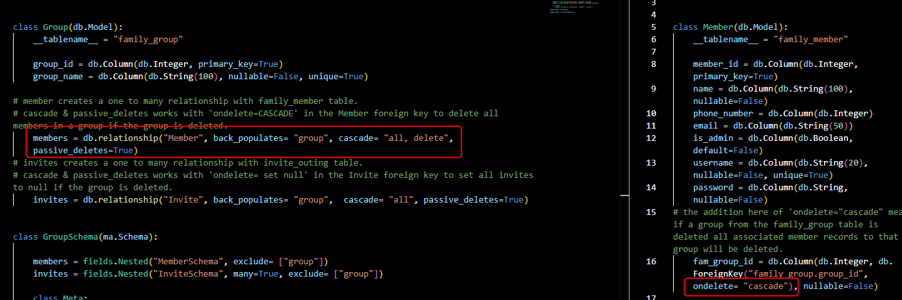
    - The interaction between the invite model is via the invites variable which back populates to the group variable in invite.py. The cascade & passive_deletes works with 'ondelete= set null' in the Invite foreign key to set all invites to null if the group is deleted. 
    - For both these interactions the query in the group_controller that would perform these actions is using the http request 'DELETE' : 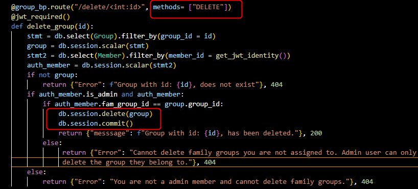

2. member.py - this model has a PK, FK and 6 attributes, then 3 relationships with the group model, bill model and the outing model. Because phone numbers and formats written vary greatly world wide, it was decided to change the format of phone_number (added during coding after the initial ERD diagram in number 6). The adjusted ERD family_member entity is:  
    - The group relationship is described above using the variables and also by the FK of 'fam_group_id'.
    - The interaction between the bill model is via the bills variable which back populates to the member variable in bill.py. The cascade & passive_deletes works with 'ondelete= set null' in the Bill foreign key to set all bills to null if a member is deleted.
    - The interaction between the outing model is via the outings variable which back populates to the member variable in outing.py. The cascade & passive_deletes works with 'ondelete= set null' in the Outing foreign key to set all outings to null if a member is deleted.
    -For both these interactions in all 3 models the code is: 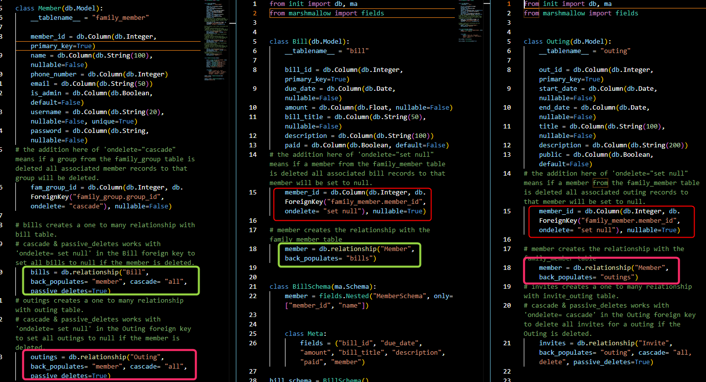
    - For these interactions the query in the member_controller that would perform these actions is using the http request 'DELETE' : 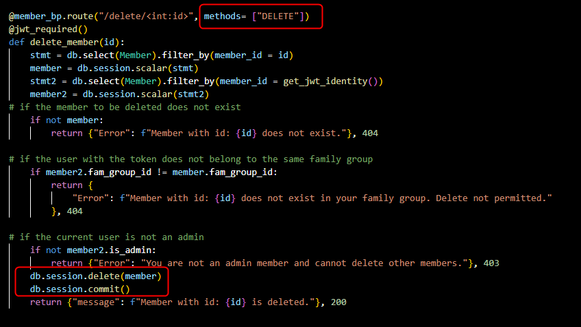

3. bill.py - this model has a PK, FK and 5 attributes. This model only has a relationship with the member model;
    - One part of this relationship is described above using the variables and also the FK of 'member_id.
    - Another is in the bill_controller whenever a method of POST, GET, PUT or PATCH and DELETE is performed the member model is queried to check the token being used matches a member_id. If a match then the action can be preformed. A example of code for the method POST is: 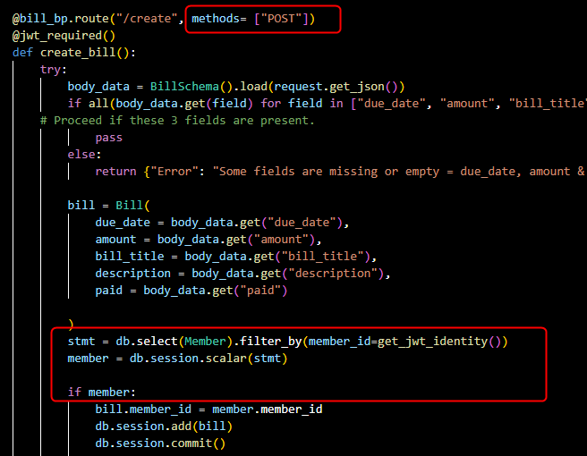

4. outing.py - this model has a PK, FK and 5 attributes. This model has 2 relationships with the member model and the invite model;
    - The relationships with the member model are described above and also has the same relationships as the bill model functions above using the FK of 'member_id'.
    - The interaction between the invite model is via the invites variable which back populates to the outing variable in invite.py. The cascade & passive_deletes works with 'ondelete= cascade' in the Outing foreign key to delete all invites for a outing if the Outing is deleted. Example of the code in both the outing and invite models: 

5. invite.py - this model has a PK, three FK's and have added 3 attributes (added during coding after the initial ERD diagram in number 6). The adjusted ERD invite_outing entity is:

    - The relationships with the member model, group model & outing model are described above and made possible by the FK's of 'member_id', 'fam_grp_id', 'out_id'.

### R8. API Endpoints
How to use the Family Schedulers API endpoints are as follows:
- #### 1. /member/create
    - Description: Allows a user to create themselves as a member and add to the database, allows the member to join or create a family group(see Note).
    - HTTP Request Verb: POST
    - Required Data: name, phone number, email, username (UNIQUE), password, family group name (UNIQUE, to create or join - see Note below).
    - Optional Data: phone number, email, is administrator(default = False if not entered)
    - Expected Response: HTTP status code 201 Created, a JSON response of the created data excluding the password.
    - Authentication Methods: None

1[member create](./docs/member-create.png)

    - Note: JSON family group name entered:
        - if is a administrator = true, and the family group name does not exist = then this new family group will be created and added to the database by the function `def create_group(family_name):` in the group_controller.py file.
            - if family group already exists = admin member added to family group.
        - if is a administrator = false, then member added to the family group name entered.

- #### 2. /member/login
    - Description: Allows a member to login to the application and creates a jwt_token.
    - HTTP Request Verb: POST
    - Required Data: username, password
    - Expected Response: HTTP status code 201 Created, a JSON response of username, is administrator and the jwt_token created.
    - Authentication Methods: Username (UNIQUE), password

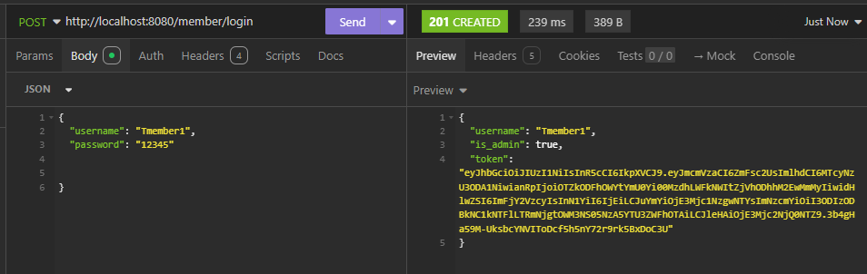

- #### 3. /member/view
    - Description: Allows a member to view all the members in their family group.
    - HTTP Request Verb: GET
    - Required Data: jwt_token
    - Expected Response: HTTP status code 200 OK, a JSON response of all members in the same family group as the member with the jwt_token.
    - Authentication Methods: jwt_token

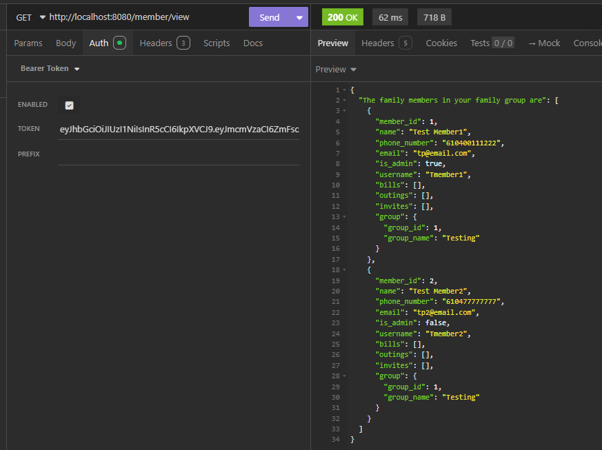

- #### 4. /member/update/id
    - Description: Allows a administrator member to update the details of the member id entered and save to the database.
    - HTTP Request Verb: PUT, PATCH
    - Required Data:  member_id
    - Optional Data: name, phone, email, is_admin, username, passsword
    - Expected Response: HTTP status code 200 OK, a JSON response of all fields updated in the database of the member id entered.
    - Authentication Methods: jwt_token, is_admin = true

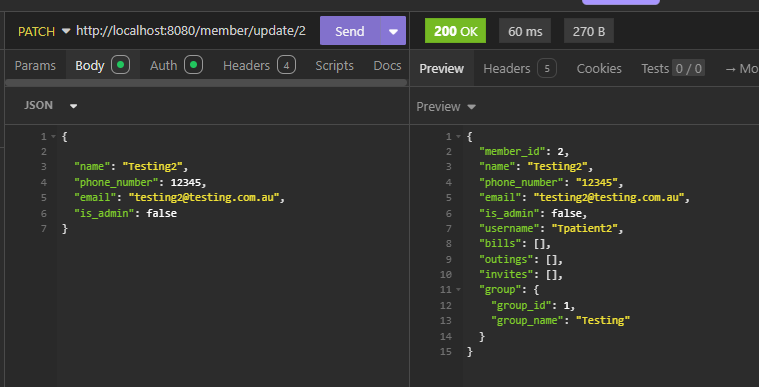

- #### 5. /member/delete/id
    - Description: Allows a administrator member to delete the member from the database of the member id entered.
    - HTTP Request Verb: DELETE
    - Required Data: member_id
    - Expected Response: HTTP status code 200 OK, a JSON response advising which member id has been deleted.
    - Authentication Methods: jwt_token, is_admin = true

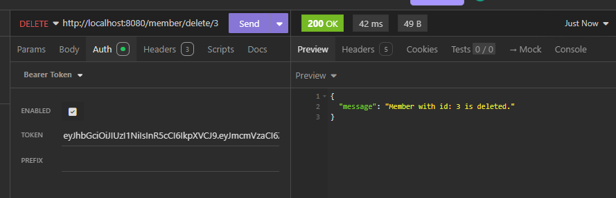

- #### 6. /group/delete/id
    - Description: Allows a administrator member to delete the family group they belong to and remove from the database.
    - HTTP Request Verb: DELETE
    - Required Data: family group id.
    - Expected Response: HTTP status code 200 OK, a JSON response advising which family group id has been deleted.
    - Authentication Methods: jwt_token, is_admin = true

![]

- #### 7. /bill/create
    - Description: Allows a member to create a bill and add it to the database.
    - HTTP Request Verb: POST
    - Required Data: due date, amount, bill title
    - Optional Data: description, is paid
    - Expected Response: HTTP status code 201 Created, a JSON response of the bill data created.
    - Authentication Methods: jwt_token

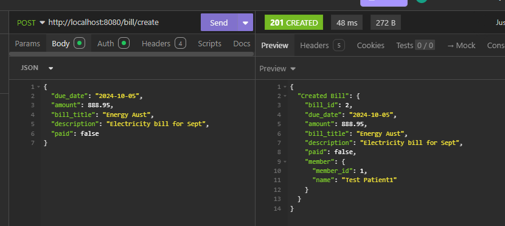

- #### 8. /bill/
    - Description: Allows a member to view all the bills entered by family members in the same family group and where the due date is past the date entered.
    - HTTP Request Verb: GET
    - Required Data: date
    - Expected Response: HTTP status code 200 OK, a JSON response of a list of the family bills where a due date is past the date entered.
    - Authentication Methods: jwt_token

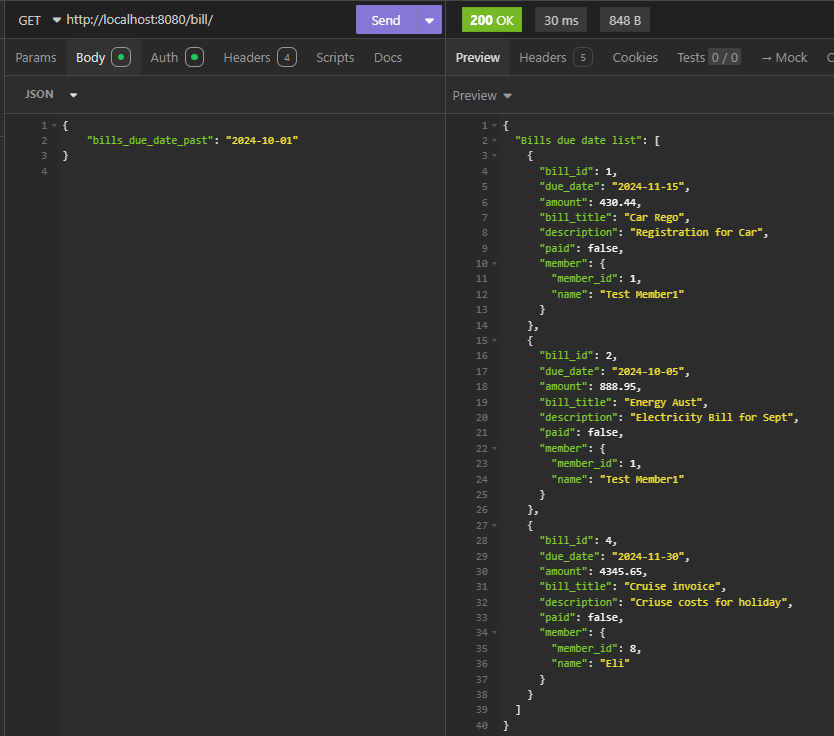

- #### 9. /bill/update/id
    - Description: Allows a member to update bill details of the bill id entered (only bills entered by same family group members), and save to the database.
    - HTTP Request Verb: PUT, PATCH
    - Required Data: bill id
    - Optional Data: due date, amount, bill title, description, is paid.
    - Expected Response: HTTP status code 200 OK, a JSON response advising the bill fields have been updated of the bill id entered.
    - Authentication Methods: jwt_token

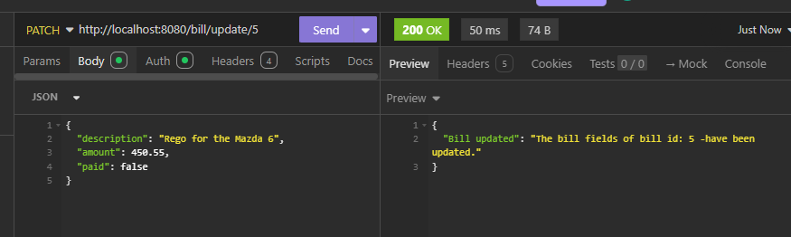

- #### 10. /bill/delete/id
    - Description: Allows a administrator member to delete a bill that has the bill id entered and was entered by a same family group member, then remove from the database.
    - HTTP Request Verb: DELETE
    - Required Data: bill id
    - Expected Response: HTTP status code 200 OK, a JSON response advising the bill with the bill id entered, has been deleted.
    - Authentication Methods: jwt_token

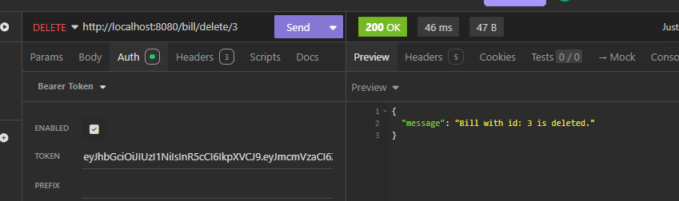

- #### 11. /outing/create
    - Description: Allows a member to create a private or public outing and save to the database.
    - HTTP Request Verb: POST
    - Required Data: start date, end date, title
    - Optional Data: description, public (default = False if not entered - see Note) 
    - Expected Response: HTTP status code 201 Created, a JSON response advising the outing created and the fields added to the database.
    - Authentication Methods: jwt_token

    - Note: if public = False then the function `def private_invite(outing_id, group_id):` in the invite_controller will be called & create a private invite for the outing created

- #### 12. /outing/
    - Description: Allows a member to view all the outings entered by family members in the same family group and where the start or end dates are within the Month & Year entered.
    - HTTP Request Verb: GET
    - Required Data: date in YYYY-MM format
    - Expected Response: HTTP status code 200 OK, a JSON response of a list of the family outings & invites to those outings, where the start or end dates are in the Month & Year entered.
    - Authentication Methods: jwt_token

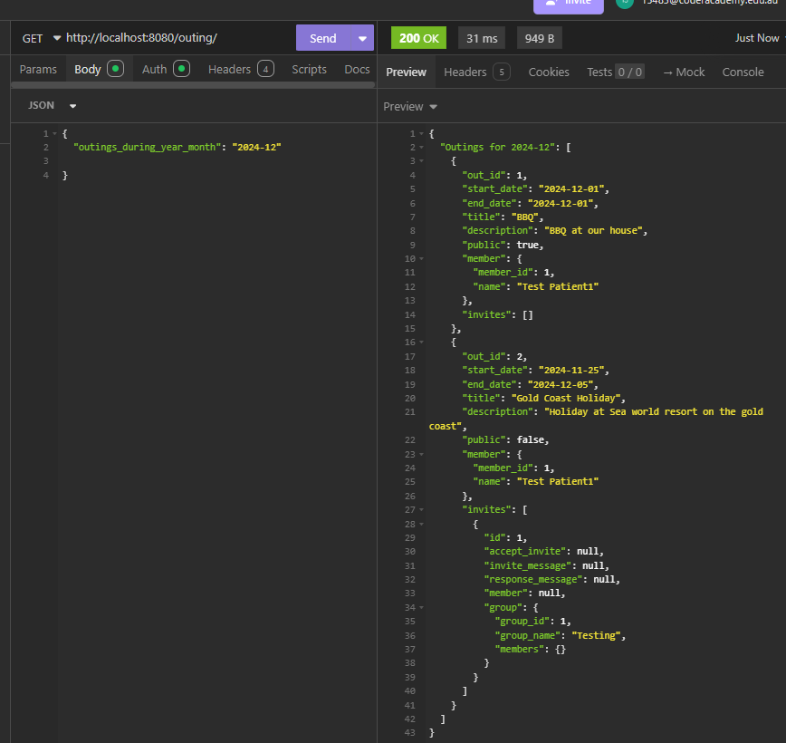

- #### 13. /outing/update/id
    - Description: Allows a member to update outing details of the outing id entered (only outings entered by same family group members), and save to the database.
    - HTTP Request Verb: PUT, PATCH
    - Required Data: outing id
    - Optional Data: start date, end date, title, description, public.
    - Expected Response: HTTP status code 200 OK, a JSON response advising the outing fields have been updated of the outing id entered.
    - Authentication Methods: jwt_token

- #### 14. /outing/delete/id
    - Description: Allows a administrator member to delete a outing that has the outing id entered and was entered by a same family group member, then remove from the database.
    - HTTP Request Verb: DELETE
    - Required Data: outing id
    - Expected Response: HTTP status code 200 OK, a JSON response advising the outiing with the outing id entered, has been deleted.
    - Authentication Methods: jwt_token

- #### 15. /invite/public
    - Description: Allows a member to create a public invite to a public outing and save to the database.
    - HTTP Request Verb: POST
    - Required Data: outing id, group id, 
    - Optional Data: invite message
    - Expected Response: HTTP status code 201 Created, a JSON response advising the public invite created and the fields saved to the database.
    - Authentication Methods: jwt_token

- #### 16. /invite/view
    - Description: Allows a member to view all the invites to outings for their family group.
    - HTTP Request Verb: GET
    - Required Data: 
    - Expected Response: HTTP status code 200 OK, a JSON response of a list of all the invites that belong to the their family group id .
    - Authentication Methods: jwt_token

- #### 17. /invite/response/invite_id
    - Description: Allows a member to respond to a invite to a outing their family group has been invited to.
    - HTTP Request Verb: PUT, PATCH
    - Required Data: accept invite, response message
    - Expected Response: HTTP status code 200 OK, a JSON response advisng the invite fields have been updated and added to the database.
    - Authentication Methods: jwt_token